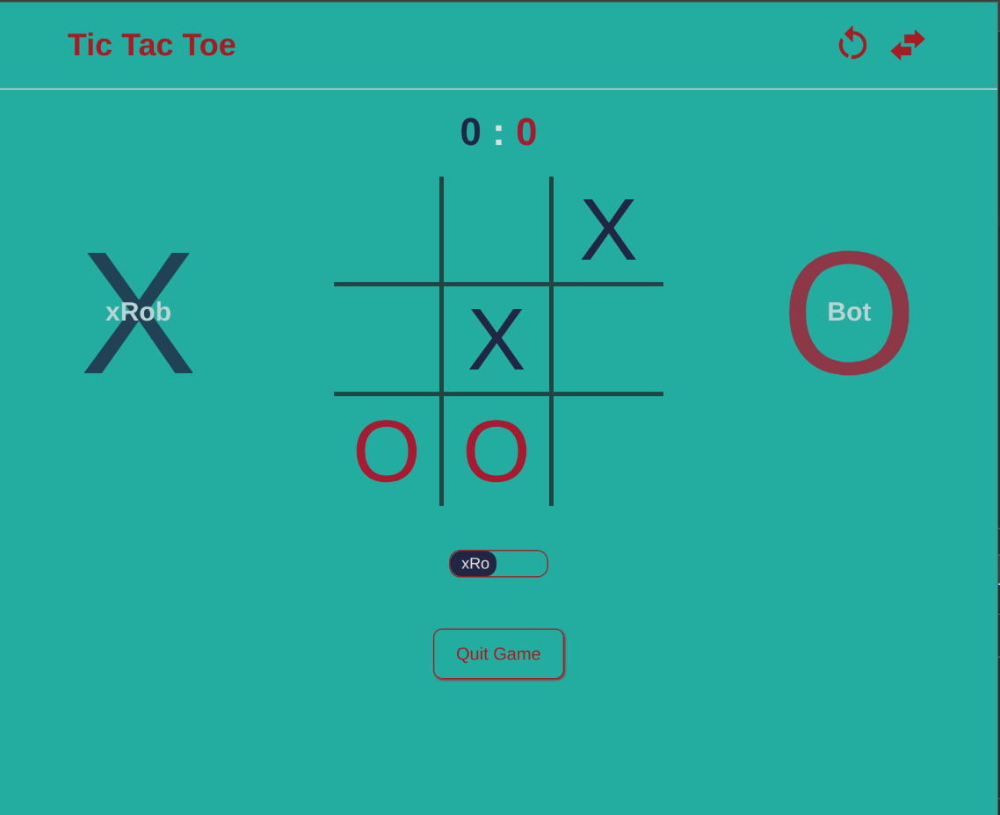

⭕❌ 

<h1 align=center>Tic-Tac-Toe</h1>

### [Click for Live Preview](https://ssekyene.github.io/Tic-Tac-Toe)

## Todos
- [x] Implement Solo play mode ie Human player Vs Bot player
- [x] Implement Two player versus play mode
- [ ] Add more smooth animations
- [ ] Apply suitable fonts and styling for the game
- [ ] Plug in game audio/music
- [ ] Improve small screen layout

## Features
- Two Player versus game mode
- Solo Player mode (Computer Vs Human)
- Game score track
- First player swap

## Motivation

The project motive was to apply modular programming specifically using js closures to build a basic game with minimal complexity.